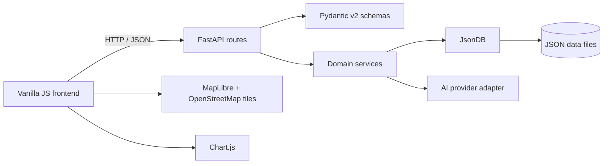

<div align="center">

# EstateExplorer

### Find the right property with less noise and better context.

An AI-assisted real-estate discovery experience that combines guided preferences, transparent matching, map-based exploration, market context, comparison tools, and personalized reports in one focused workflow.

<p>
	<a href="https://python.org"></a>
	<a href="https://fastapi.tiangolo.com"></a>
	
	<a href="https://maplibre.org"></a>
	<a href="LICENSE"></a>
</p>

<p>
	<a href="#-quick-start">Quick start</a> |
	<a href="#-product-tour">Product tour</a> |
	<a href="#-architecture">Architecture</a> |
	<a href="#-api-surface">API</a>
</p>

</div>

## Product preview

<p align="center">
	
</p>

<p align="center"><em>EstateExplorer homepage: conversational discovery, transparent match scoring, and premium property presentation.</em></p>

> **Status:** Demonstration-ready product prototype. The included property and market records are labeled demo data and are not live listings.

## Why this project

Property search usually makes people translate their needs into filters before they understand what matters. EstateExplorer reverses that flow: it starts with intent, gathers preferences progressively, and turns those preferences into explainable recommendations.

The result is a calmer discovery loop:

`intent -> preferences -> matches -> context -> decision`

## Product tour

| Experience | What it does |
| --- | --- |
| **AI Advisor** | Collects intent through a conversational, one-question-at-a-time questionnaire instead of one overwhelming form. |
| **Smart matching** | Scores properties against the user's preferences and exposes the reasoning behind a match. |
| **Natural-language search** | Converts prompts such as `4 bed house in Karachi under 70M` into structured search criteria. |
| **Map exploration** | Places properties on a MapLibre map with location-aware browsing and price markers. |
| **Market intelligence** | Adds location-level trends, price context, and summary metrics to the property search. |
| **Compare** | Puts shortlisted properties side by side so trade-offs are easy to scan. |
| **Reports** | Generates personalized property reports in PDF, Markdown, or JSON formats. |
| **Saved workspace** | Keeps a user's shortlist available across the discovery flow using a local session identifier. |
| **Responsive UI** | Supports desktop, tablet, and mobile layouts with a light/dark theme system. |

## Quick start

### Requirements

- Python 3.11 or newer
- A browser with ES module support
- An OpenAI API key only if you want live AI responses; the core app can run without one

### 1. Install the backend

```bash
git clone https://github.com/muhammadsami987123/-EstateExplorer EstateExplorer
cd EstateExplorer/backend
python -m venv .venv

# Windows PowerShell
.\.venv\Scripts\Activate.ps1

# macOS/Linux
# source .venv/bin/activate

pip install -r requirements.txt
```

### 2. Configure optional AI settings

Create `backend/.env` when you want to configure an AI provider:

```env
LLM_PROVIDER=openai
OPENAI_API_KEY=your_api_key_here
MODEL_NAME=gpt-4o-mini
```

The settings loader also supports `GEMINI_API_KEY`, `DATA_DIR`, `APP_NAME`, and `VERSION`. Never commit real credentials.

### 3. Run the application

```bash
cd backend
python run.py
```

Open [http://localhost:8000](http://localhost:8000). FastAPI's interactive documentation is available at [http://localhost:8000/docs](http://localhost:8000/docs).

On Windows, `start.bat` provides the project-level startup shortcut. Opening `frontend/index.html` directly is possible for static browsing, but backend-powered features require the FastAPI server.

## Architecture



### Design decisions

- **JSON database:** file-backed records keep the demo easy to inspect, reset, and run without a database server. `JsonDB` handles the persistence boundary and locking.
- **Vanilla JavaScript:** ES modules keep the frontend lightweight and dependency-free while still separating API access, shared utilities, and page behavior.
- **Backend-owned logic:** filtering, sorting, matching, and report generation stay on the server. AI is used for natural-language understanding, explanations, and summaries.
- **Validated boundaries:** API payloads use Pydantic v2 schemas before reaching business logic.
- **Context-limited AI:** AI features receive only the property and preference context provided by the application request.

## Repository map

```text
EstateExplorer/
├── backend/
│   ├── app/
│   │   ├── api/                 # FastAPI route modules
│   │   ├── data/                # Demo JSON records
│   │   ├── schemas/             # Pydantic request/response models
│   │   ├── services/            # Matching, AI, market, and report logic
│   │   ├── config.py            # Environment-backed settings
│   │   ├── json_db.py           # JSON persistence engine
│   │   └── main.py              # FastAPI application
│   ├── requirements.txt
│   └── run.py
├── frontend/
│   ├── advisor.html             # Guided AI questionnaire
│   ├── properties.html          # Search results and map discovery
│   ├── property.html            # Property detail view
│   ├── compare.html             # Side-by-side comparison
│   ├── market.html              # Market intelligence
│   ├── reports.html             # Generated reports
│   ├── saved.html               # Saved properties
│   ├── css/main.css             # Shared design system and themes
│   └── js/                      # ES module API and UI utilities
├── start.bat
└── README.md
```

## API surface

| Method | Endpoint | Purpose |
| --- | --- | --- |
| `GET` | `/api/properties` | List properties with filters and sorting |
| `GET` | `/api/properties/{id}` | Return one property with its detail data |
| `POST` | `/api/search` | Match properties against structured preferences |
| `GET` | `/api/locations/countries` | List top-level locations |
| `GET` | `/api/locations/{id}/children` | Resolve the next location level |
| `GET` | `/api/market/{location_id}` | Return market data for a location |
| `POST` | `/api/reports/generate` | Generate a personalized report |
| `POST` | `/api/ai/chat` | Continue an advisor conversation |
| `POST` | `/api/ai/extract` | Extract search criteria from natural language |

Use Swagger UI at `/docs` or the OpenAPI JSON document at `/openapi.json` for request and response schemas.

## Demo data and AI boundaries

All property listings, location records, and market statistics in `backend/app/data/` are demonstration datasets. They do not represent real availability, pricing, investment returns, or market conditions. Verify all property information independently before making a financial or real-estate decision.

When an AI provider is configured, the application should be treated as an assistant for discovery and explanation, not as a source of verified legal, financial, valuation, or investment advice.

## Contributing

1. Create a focused branch for your change.
2. Keep backend logic in `services/`, validation in `schemas/`, and route wiring in `api/`.
3. Preserve the JSON-only database boundary; do not introduce SQLAlchemy or a separate ORM.
4. Keep frontend pages as vanilla ES modules and preserve the shared theme variables in `frontend/css/main.css`.
5. Test the affected API flow through `/docs` before opening a pull request.

## Author

**Muhammad Sami Asghar Mughal**

- [Portfolio](https://muhammad-sami.vercel.app)
- [LinkedIn](https://linkedin.com/in/muhammad-sami-3aa6102b8)
- [GitHub](https://github.com/muhammadsami987123)

## License

This project is available under the [MIT License](LICENSE).
